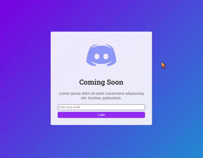

# 💻 Discord Login Page Clone

A dummy clone of the **Discord login page** built using pure HTML and CSS. This project replicates the layout and design of Discord’s login UI for frontend practice. It has no backend or login functionality — it's purely for visual and structural learning.

## 📸 Preview

  

## 🚀 Features

- Clean layout inspired by Discord’s login page  
- Responsive design (if applicable)  
- Built with only HTML and CSS  
- Great for frontend/UI practice

## 📂 How to Use

1. Clone the repository:
   ```bash
   git clone https://github.com/Asad-bot07/discord-login-clone.git
